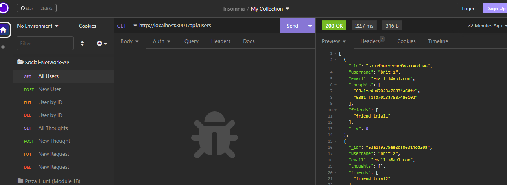
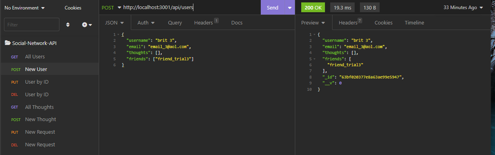

# social-network-api

## Project Description

This project is a backend server with API routes that accomatdate user and thought RESTful api routes.

# Tools Used to Create This Project

* JavaScript
* MongooseDB 
* Express.js

## Link To Deployed Application

https://drive.google.com/file/d/1VOP4FohOYuxMjQdF6AE50T6VyK1obYJS/view

## Future Work

*I would like to edit a few of the routes and to not include as much information

## Screenshots of the Application

;
;